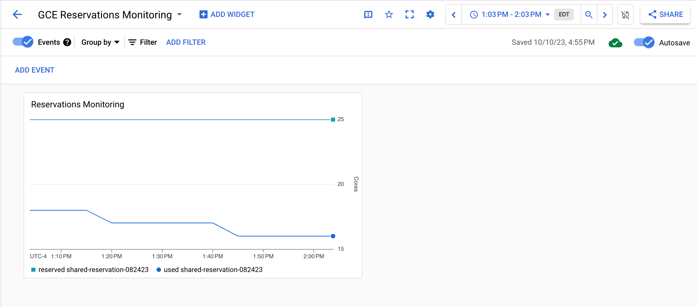
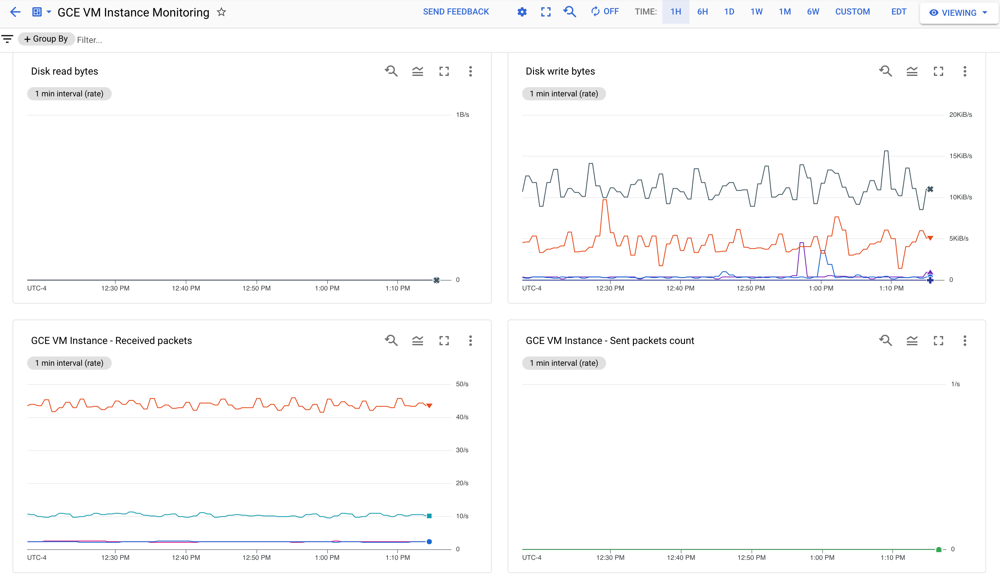
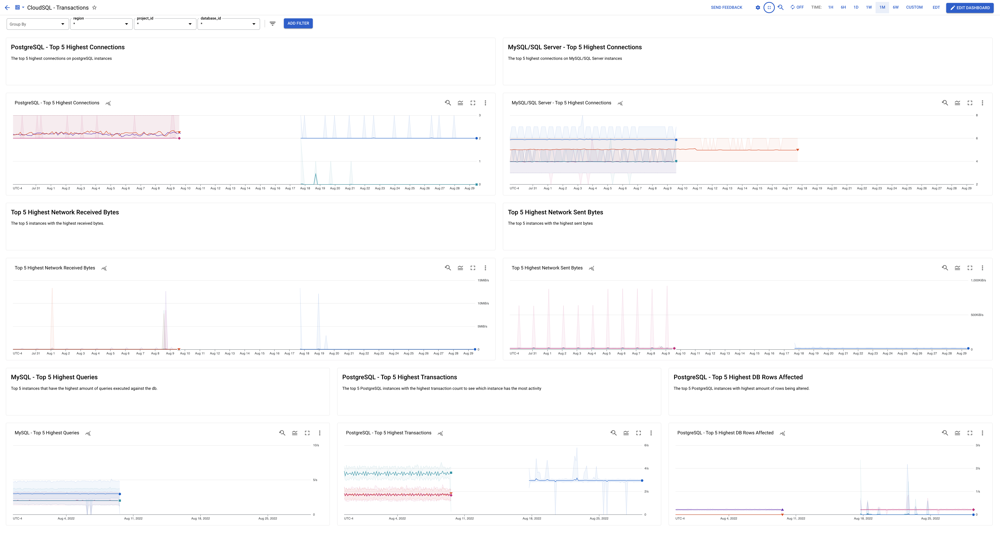

# Monitoring Service

This module allows creation of custom dashboards and alerting policies.

## Usage
Basic usage of this module is as follows:
```tf
module "monitoring" {
  source                = "./monitoring"
  monitoring_project_id = var.monitoring_project_id
  monitored_projects_id = var.monitored_projects_id
  email_notification    = var.email_notification
}
```

## Inputs
| Name                     | Description                                                 | Type           | Required |
| -------------------------| ------------------------------------------------------------| -------------- | -------- |
| `monitoring_project_id`  | Project id of the host monitoring project to be created     | `string`       | yes      |
| `monitoring_projects_id` | List of projects to be monitored                            | `list(string)` | yes      |
| `email_notification`     | List of emails to which alerting notifications will be sent | `string`       | yes      |


## Outputs
| Name             | Description                                     | 
|------------------|-------------------------------------------------| 
| `project_id`     | Project id of the project to be monitored       | 
| `resource_id`    | The resource id for the dashboard               | 
| `console_link`   | The destination console URL for the dashboard   |

## Module structure
- **monitoring.tf**: Enables the required services. Contains code related to deploying monitoring dashboards.
- **alerting.tf**: Contains code related to deploying alerting policies.
- **variables.tf**: Contains relevant variables needed.
- **outputs.tf**: Contains relevant outputs.
- **dashboards**: Folder that contains json configuration files needed to create the dashboards.
- **examples**: Folder that contains some dashboard examples.

## Dashboards
The implemented dashboards are the following...

### Regarding **GCE Instances**: 

**``gce-autoscaler-monitoring.json``**

This dashboard has 2 charts for the related autoscaler metrics. 
 - Current autoscaler utilization
 - Serving capacity


**``gce-reservations-monitoring.json``**

To monitor local and shared reservation usage. 



**``gce-vm-instance-monitoring.json``**

This dashboard has 10 charts for the related VM metrics, including metrics for CPU, disk read/write and network. 
- CPU utilization
- VM instance uptime
- Disk read operations
- Disk write operations
- Disk read bytes
- Disk write bytes
- Received packets
- Sent packets
- Received bytes
- Sent bytes





**``gce-vm-lifecycle-dashboard.json``**

Enables visualization of system events and admin activities to monitor VM lifecycle events such as shutdowns, reboots, host errors, etc.
- VM lifecycle timeline
- VM lifecycle events


### Related to **GKE Clusters**:

**``gke-workloads-at-risk.json``**

This dashboard has 12 charts using the related Kubernetes metrics to show workloads which are at reliability and performance risks due to BestEffort and Burstable workloads running above request for CPU and memory.


**``gke-cluster-monitoring.json``**

This dashboard has 18 charts for the related Kubernetes metrics, including metrics for the worker nodes such as total allocatable CPU cores and memory; metrics for containers such as CPU and memory request utilization; metrics for Pods such as network bytes received and transmitted.


**``gke-active-idle-clusters.json``**

This dashboard has 2 charts using the related Kubernetes metrics to show the container count and resource usage in user namespaces within a specific period. Users can see how active and idle their clusters are.


**``gke-compute-resources-cluster-view.json``**

This dashboard features filters to drill down to a specific cluster, and has 14 charts for the related Kubernetes metrics. It summarizes metrics like CPU and memory utilization as well as network sent and received bandwidth for the cluster, grouping over namespace.


**``gke-compute-resources-node-view.json``**

This dashboard features filters to drill down to a specific cluster, and has 17 charts using the related Kubernetes metrics. It summarizes metrics like CPU and memory utilization as well as network sent and received bandwidth for nodes that make up a given cluster.


**``gke-compute-resources-workload-view.json``**

This dashboard features filters to drill down to a specific cluster, namespace and workload. It has 14 charts for the related Kubernetes metrics and summarizes CPU and memory utilization as well as network sent and received bandwidth for pods that make up a given workload.


**``gke-nodes-pods-cluster-view.json``**

This dashboard has 10 charts using the related Kubernetes metrics to show how pods and containers are distributed within nodes and within namespaces. Container start, restart and autoscaler events are also plotted over time.


**``gke-optimization-signals.json``**

This dashboard has 10 charts using the related Kubernetes metrics and summarize GKE cost optimization signals based on the State of Kubernetes Cost Optimization report includes demand scaling, spot instance usage, cluster bin packing and workload rightsizing.


### Related to Storage:

**``bigtable-monitoring.json``**

This dashboard has 13 charts for the related Bigtable metrics, including CPU load, Disk load, Request count, Error count, and others.

**``cloud-storage-monitoring.json``**

This dashboard has 6 charts for the related Cloud Storage metrics, including Total object count, Total bytes, Bucket object count, Bucket total bytes, Bucket - Received/Sent Bytes, and Bucket Request count.

**``cloudsql-monitoring.json``**

This dashboard has 10 charts for the related Cloud SQL metrics, including Instance state, Server up, and CPU/Memory/Disk utilization etc. This dashboard provides an aggregate view of total resources of your SQL databases. You can use database engine-specific dashboards for additional metrics of different database engines such as MySQL and PostgreSQL.

**``cloudsql-mysql-monitoring.json``**

This dashboard has 6 charts for the Cloud SQL(MySQL) metrics, including Database queries, Connections, Network bytes received/sent, and the InnoDB page metrics.

**``cloudsql-postgre-monitoring.json``**

This dashboard has 3 charts for the Cloud SQL(PostgreSQL) metrics, including Number of transactions, Connections, and Lag bytes.

**``datastore-monitoring.json``**

This dashboard has 4 charts for the Datastore metrics, including Index writes, Datastore requests, Sizes of read entities, and Sizes of written entities.

**``firestore-monitoring.json``**

This dashboard has 7 charts for the Firestore metrics, including Document Reads, Document Writes, Document Deletes, Datastore Request, Connected Clients, Snapshot Listeners, and Rule Evaluations.

**``memcache-monitoring.json``**

This dashboard has 10 charts for the Memorystore for Memcached metrics, including Memory usage by node, CPU usuage by node, Hit ratio, Eviction count, Items by node, and others.

**``redis-ops-monitoring.json``**

This dashboard has 10 charts for the operational metrics of Memorystore for Redis, including Instance Uptime, Connected Clients, Blocked Clients, Calls, Time per Call, and Average TTL, etc.

**``redis-stats-monitoring.json``**

This dashboard has 14 charts for the stats of Memorystore for Redis, including Hits, Misses, Cache Hit Ratio, Evicted Keys, Expired Keys, Memory Usage Ratio, and others.

**``spanner-monitoring.json``**

This dashboard has 14 charts for the Cloud Spanner metrics, including Count of queries by database, API requests by method, API bytes sent/received, CPU and storage utilization, etc.


### Related to **Networking Load Balancers**:

**``https-loadbalancer-monitoring.json``**

This dashboard has 9 charts for the related HTTP/s load balancer metrics, including Request Count, Total Latency, Request Bytes, Response Bytes, Frontend RTT, Backend Request Count, Backend Request Bytes, and Backend Response Bytes.

**``https-lb-backend-services-monitoring.json``**

This dashboard has 10 charts for the related HTTP/s load balancer metrics, including Backend Request Count by Code Class, Backend Request Count by Path, Error Rate, Error Count by Path and Code, Backend Latency, Backend P50 Latency by Path, Backend Request Bytes, Backend Request Bytes by Path, Backend Response Bytes and Backend Response Bytes by Path all grouped by backend_target_name. It is intended to be used with a dashboard-wide filter on backend_target_name.

**``network-tcp-loadbalancer-monitoring.json``**

This dashboard has 5 charts for the related network TCP load balancer metrics, including RTT latencies, Ingress TCP packets, Ingress TCP bytes, Egress TCP packets, and Egress TCP bytes.

**``network-udp-loadbalancer-monitoring.json``**

This dashboard has 4 charts for the related network UDP load balancer metrics, including Ingress UDP packets, Ingress UDP bytes, Egress UDP packets, and Egress UDP bytes.

**``tcp-ssl-loadbalancer-monitoring.json``**

This dashboard has 6 charts for the related TCP/SSL load balancer metrics, including Frontend RTT, Open connections, New connections opened, Closed connections, Ingress bytes, and Egress bytes.


### Related to **Google Cloud SQL Instances**: 

**``cloudsql-general.json``**

This dashboard has charts displaying logs from CloudSQL as well as charts of instance states and network throughput.


**``cloudsql-replication.json``**

This dashboard has charts displaying information about replication states and replication performance from CloudSQL.


**``cloudsql-transactions.json``**

This dashboard has charts displaying information regarding transactions and queries from mysql, mssql, and postgresql in CloudSQL as well as charts relating to network activity.




## Alerting Policies
*Note: There are lots of alerting policies as a JSON format in GCP repos but we cannot use them in terraform, as the resource we need to create is ``resource "google_monitoring_alert_policy" "alert"`` and it does not accept a json file (like in the dashboards). Consequently, the template for resource ``"google_monitoring_alert_policy"`` has been accordingly adapted with the JSON information for each alert.*

The alerting policies created are the following...

**Related to Infrastructure:**

### VM Instance - High CPU Utilization ###
Monitor CPU utilization across all GCE VMs in the current project and will notify you if the CPU utilization on any VM instance rises above 99% for 30 minutes or more."

### VM Instance - High Memory Utilization ###
Monitor memory utilization across all GCE VMs in the current project and will notify you if the memory utilization on any VM instance rises above 99% for 30 minutes or more. This requires the Ops Agent to be installed on VMs to collect the memory utilization metric.

### VM Instance - High Disk Utilization
Monitor disk utilization across all GCE VMs in the current project and will notify you if the disk utilization on any VM instance rises above 90% for 30 minutes or more. This requires the Ops Agent to be installed on VMs to collect the disk utilization metric.

### GKE Container - High CPU Limit Utilization
Monitors CPU limit utilization across all containers within a cluster and alerts if a container's CPU limit utilization is above 90% on average for 5 minutes.

### GKE Container - High Memory Limit Utilization
Monitors memory limit utilization across all containers within a cluster and alerts if a container's memory limit utilization is above 90% on average for 1 minute.

### GKE Pod - FailedScheduling Log Event
Monitors log events with cluster and alerts if there is an event with reason 'FailedScheduling'.
*Note: Review interpolation, this is as it was in the JSON files, will not work inside "resource".*

### Cloud SQL - Instance in Failed State
This Alert fires when any CloudSQL Instance has stopped working and has entered an error state. 
 
### Cloud VPN - High VPN tunnel bps
Alerts when the sum of ingress and egress bytes exceeds 70% of the 3-Gbps (262.5 MBps) limit for a given VPN tunnel. This can help you decide whether to provision additional VPN tunnels.

### Cloud Interconnect - High interconnect ingress
Alerts when the Ingress bytes per second exceeds 70% of an interconnect VLAN attachment's capacity. This can help you decide whether to provision additional capacity or create additional attachments.

### Cloud Interconnect - High interconnect egress 
Alerts when the Egress bytes per second exceeds 70% of an interconnect VLAN attachment's capacity. This can help you decide whether to provision additional capacity or create additional attachments.


**Related to Application:**

### Uptime checks for all Load Balancers
Uptime checks lets you verify the availability of your service via HTTP(S) or TCP health checks. Only the uptime checks for **HTTP, HTTPS and TCP** will be created and the alerts will be configured manually on the console. 


## References

All dashboards come from this source: https://github.com/GoogleCloudPlatform/monitoring-dashboard-samples/tree/master/dashboards

Alert policies found in: https://github.com/GoogleCloudPlatform/monitoring-dashboard-samples/tree/master/alerts

Another useful link for monitoring and alerting:
https://cloud.google.com/composer/docs/terraform-cross-project-monitoring
https://cloud.google.com/monitoring/alerts/terraform

Useful link for monitoring third-party applications : https://cloud.google.com/monitoring/agent/plugins

Service account impersonation: https://cloud.google.com/blog/topics/developers-practitioners/using-google-cloud-service-account-impersonation-your-terraform-code


